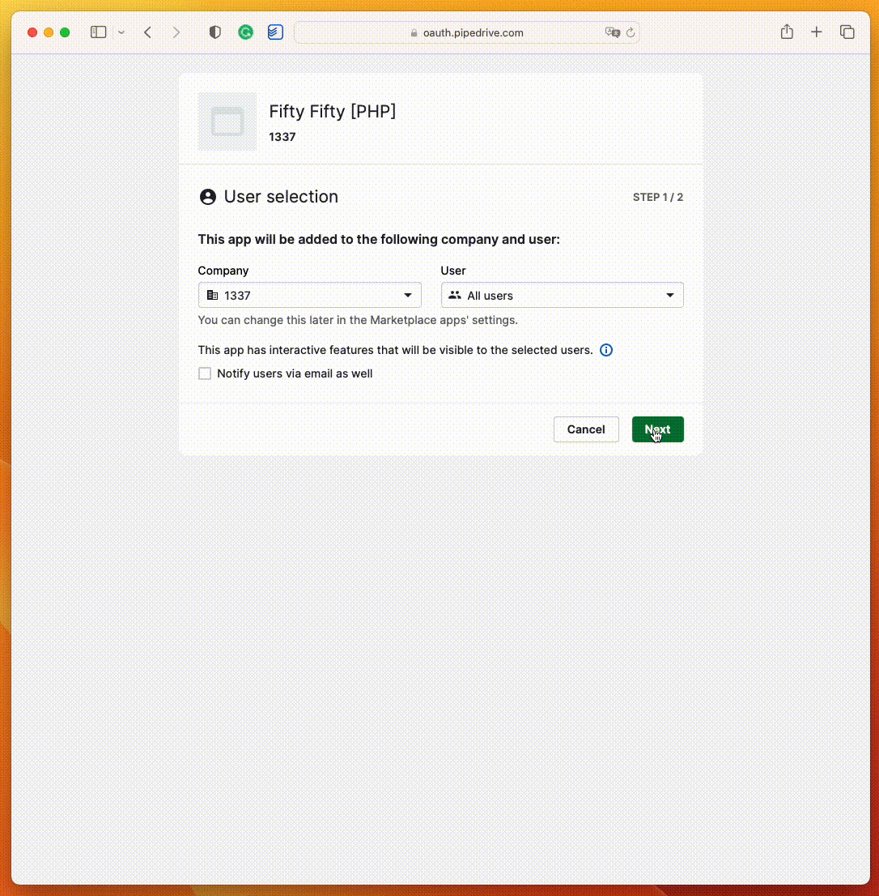

# Fifty / Fifty example app

Clone of https://github.com/pipedrive/FiftyFifty/ example app.

A very basic app with example how to:

 - authorize with OAuth using passportjs
 - get all open deals from Pipedrive
 - mark selected deal randomly as won or lost

⚠️ **Disclaimer**

**This repository contains non-production code.**\
Sensitive information, such as tokens or credentials, should always be securely encrypted and stored according to best practices. Do not use hardcoded or plaintext tokens in production.

## Installation and usage

Required: PHP >= 8.1 (recommended) with sqlite.

- run `composer install`
- [create a new Marketplace app](https://pipedrive.readme.io/docs/marketplace-creating-a-proper-app) or use existing one
- copy .env.example to .env and update it with your app properties:
  - PIPEDRIVE_CLIENT_ID=
  - PIPEDRIVE_CLIENT_SECRET=
  - PIPEDRIVE_REDIRECT_URI=http://127.0.0.1:8000/auth/pipedrive/callback
- run `npm run dev` to watch FE assets
- run `php artisan key:generate`
- run `php artisan serve`

## Demo

# Credits

- [Laravel](https://laravel.com/)
