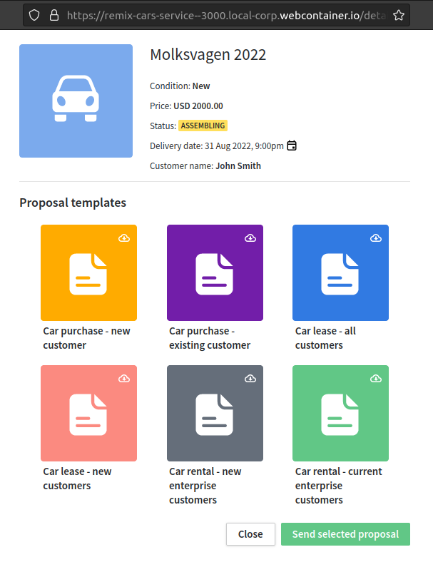

# Car Services Example app

This is an example [Remix](https://remix.run) app that demonstrates and experiments with [Custom UI Extensions](https://pipedrive.readme.io/docs/custom-ui-extensions) in its three types: Custom panels, Custom modals and Custom UI for app settings.

**NB:** This app should not be used as a production-ready app as OAuth installation and token verification are not covered here.\
Sensitive information, such as tokens or credentials, should always be securely encrypted and stored according to best practices. Do not use hardcoded or plaintext tokens in production.

## Examples

### Custom Modal



### Custom Panel


### Custom UI Settings


## Run with StackBlitz

This option works well if you want to try out the examples without the need of local development setup or deployment to the cloud servers.

Open [project](https://stackblitz.com/edit/remix-cars-service) in StackBlitz.

Use the generated URL in Marketplace Manager as the iframe URL for Custom UI Extension, i.e. 
- Set `https://remix-cars-service--3000.local.webcontainer.io/list` as the Iframe URL for the Custom Panel
- Set `https://remix-cars-service--3000.local.webcontainer.io/details` as the Iframe URL for the Custom Modal. The name of Custom UI Extension should be set as **Details**, otherwise it won't be opened from Custom Panel with SDK command
- Set `https://remix-cars-service--3000.local.webcontainer.io/settings` as the Iframe URL for the Settings page

### Known issues

There is a limitation with Backend API when running service with StackBlitz: the item proposal update and reset from settings will not work. Please choose [Deploy with Vercel](#deploy-with-vercel) for a full working example. 

## Deploy with Vercel<a id="deploy-with-vercel"></a>

### Create project

[](https://vercel.com/new/clone?repository-url=https%3A%2F%2Fgithub.com%2Fpipedrive%2Fexample-apps%2Ftree%2Fmaster%2Fapps%2Fremix-cars-service)

#### Alternative: use CLI

Clone the repository and switch to the folder with the project. Install `vercel` CLI tool and follow its instructions. 

```sh
npm i -g vercel
vercel
```

### Setup application in [Marketplace Manager](https://pipedrive.readme.io/docs/marketplace-manager)

Use the **generated** project URL in Marketplace Manager for Custom UI Extension, i.e.
- Set `https://remix-cars-service.vercel.app/list` as the Iframe URL for the Custom Panel.
- Set `https://remix-cars-service.vercel.app/details` as the Iframe URL for the Custom Modal. The name of Custom UI Extension should be set as **Details**. Otherwise, it won't be open from the Custom Panel with the SDK command.
- Set `https://remix-cars-service.vercel.app/settings` as the Iframe URL for the Settings page

### Known issues

If you see a 404 error on the main page, you might need to choose `Remix` as the Framework Preset for your project in settings.


## Local development

From your terminal:

```sh
npm i
npm run dev
```

This starts your app in development mode, rebuilding assets on file changes.

Open up http://localhost:3000 and you should be ready to go!

# Credits

- [Remix](https://remix.run/)
- [StackBlitz](https://stackblitz.com/)
- [Vercel](https://vercel.com/)
