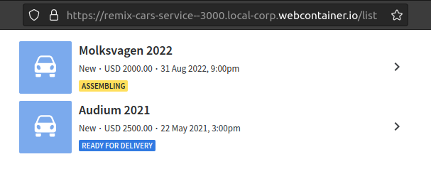

# Cars Service Example app

Example [Remix](https://remix.run) app to demonstrate and experiment with [Custom App Surfaces](https://pipedrive.readme.io/docs/custom-app-surfaces): panels, modals and settings page.

**NB:** Shall not be used as production-ready app, OAuth installation and token verification is not covered here. 

## Examples

### Custom Surface Modal


### Custom Surface Panel



### Custom Surface Settings


## Run with StackBlitz

This option works very well if you want to try out the examples without a need of local development setup or deployment to the cloud servers.

Open [project](https://stackblitz.com/edit/remix-cars-service) in StackBlitz.

Use generated URL in Marketplace Manager as iframe URL for custom surfaces, i.e. 
- set `https://remix-cars-service--3000.local.webcontainer.io/list` as Iframe URL for Custom Surface Panel.
- set `https://remix-cars-service--3000.local.webcontainer.io/details` as Iframe URL for Custom Surface Modal.
- set `https://remix-cars-service--3000.local.webcontainer.io/settings` as Iframe URL for Settings page

### Known issues

There is limitation with Backend API when running service with StackBlitz - item proposal update and reset from settings will not work. Please choose [Deploy with Vercel](#deploy-with-vercel) for completely working example. 

## Deploy with Vercel<a id="deploy-with-vercel"></a>

Install `vercel` CLI tool and follow its instructions. 

```sh
npm i -g vercel
vercel
```

Use **generated** project URL in Marketplace Manager for custom surfaces, i.e.
- set `https://remix-cars-service.vercel.app/list` as Iframe URL for Custom Surface Panel.
- set `https://remix-cars-service.vercel.app/details` as Iframe URL for Custom Surface Modal.
- set `https://remix-cars-service.vercel.app/settings` as Iframe URL for Settings page

### Known issues

If you see 404 error on the main page, then you might need to choose `Remix` as Framework Preset for your project in settings.


## Local development

From your terminal:

```sh
npm run dev
```

This starts your app in development mode, rebuilding assets on file changes.

Open up http://localhost:3000 and you should be ready to go!

# Credits

- [Remix](https://remix.run/)
- [StackBlitz](https://stackblitz.com/)
- [Vercel](https://vercel.com/)
